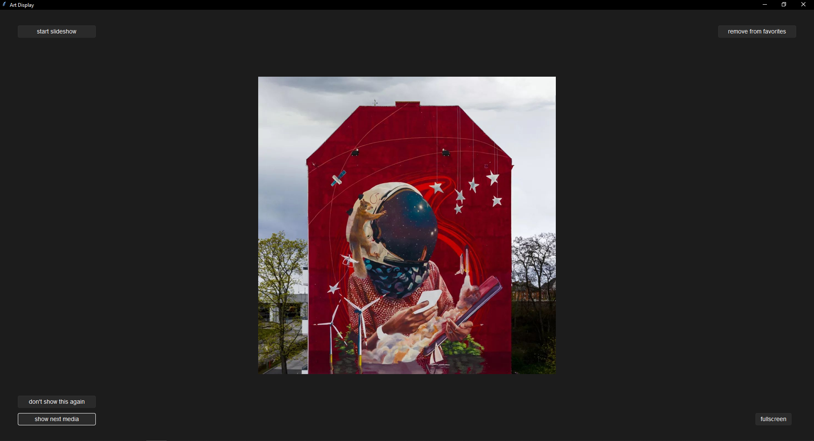

# WORK IN PROGRESS

# Instagram Art Display

## Project Pitch
There is so much beautiful art on Instagram. I always found it unfortunate that you're mostly looking at it through the phone for a couple of seconds not really being to appreciate it for a longer time on a bigger scale.
That's why I looked for ways to bringing it to a bigger screen and created Instagram Art Display:
- A small app that serves you the media from users you're following, displaying it statically or through a slide show
- It trains a simple ML model with keras binary classification according to your personal preferences and can select media based on it

(credit: [innerfields](https://www.instagram.com/p/CirgC3hoLpL))

## How to use
- Use Python 3.11.X
- Insert into config.json file:
- Your file paths
- Login data for instagram account used for retrieving media (should be a disposable account)
- The user name from the instagram account that follows the accounts you want to get media from (needs to be public)
- Run display-app.py

## Credits
- To the creators of [instagrapi](https://github.com/subzeroid/instagrapi). This project would not be possible without them.
- And of course to the artists. Please donate to them or buy their art if possible for you.

## Approach
I first wrote this as a monolithic app with Python and tkinter, because Python is the language I know best and it allowed me to get an MVP of the display function working faster in order to focus on the most critical quality aspect of the app: validating if I can get a useful ML model working.
Next up is shifting this to a more appealing UI and getting the architecture more modular. See the following tasks for details:

### Priority Fixes
- Improve loading time of keras / import only necessary
- Improve loading time of next ML selected media with caching
- Rewrite all remaining raw sqlite query functions to sqlalchemy query functions

### Epics Opportunities
- Experiment ML training with additional data label "like the style, but not this particular media"
- Shift to JS frontend and serve data through fastAPI OR Django
- Enable UI adjustable settings
- Experiment with recommender ML model
- Experiment with training ML model for generalizability to solve cold start problem
- Enable followee list filtering through e.g. profession or keywords
- Enable remote and scheduling control, e.g. with IFTTT integration
- Enable donations for the artists through their provided options in bio link
